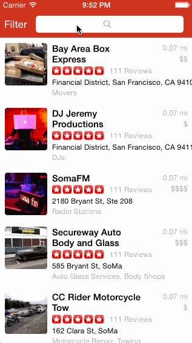

# Yelp Demo

Yelp demo app. I took a lot of time to get the autolayout stuff good-ish. Filters are working but the collapsing may have introduced some bugs.

Time spent: 20 hours spent in total

Completed user stories:

 * [x] Required: Table rows should be dynamic height according to the content height
 * [x] Required: Custom cells should have the proper Auto Layout constraints
 * [x] Required: Search bar should be in the navigation bar 
 * [ ] Optional: infinite scroll for restaurant resultserror. I had this working at different times. Had to abandon it.
 * [x] Required: The filters you should actually have are: category, sort (best match, distance, highest rated), radius (meters), deals (on/off).
 * [x] Required: The filters table should be organized into sections as in the mock.
 * [x] Required: You can use the default UISwitch for on/off states.
 * [x] Required: Radius filter should expand as in the real Yelp app. This collapses but I'm cramming it in. Not super functional.
 * [ ] Required: Categories should show a subset of the full list with a "See All" row to expand. Category list is here: http://www.yelp.com/developers/documentation/category_list. I didn't get to this. I ran out of time this week.
 * [x] Required: Clicking on the "Search" button should dismiss the filters page and trigger the search w/ the new filter settings.
 
Notes:

This week was a nightmare - work and travel. I still got to spend a lot of time on this project but didn't realize the filters view was going to be so labor-intensive. Fortunately, I got to spend a good amount of time on the auto-layout and UI aspects of the search view. Unfortunately, I didn't get to spend more time on UI polish which is what I enjoy.

Walkthrough of all user stories:

GIF created with [LiceCap](http://www.cockos.com/licecap/).
